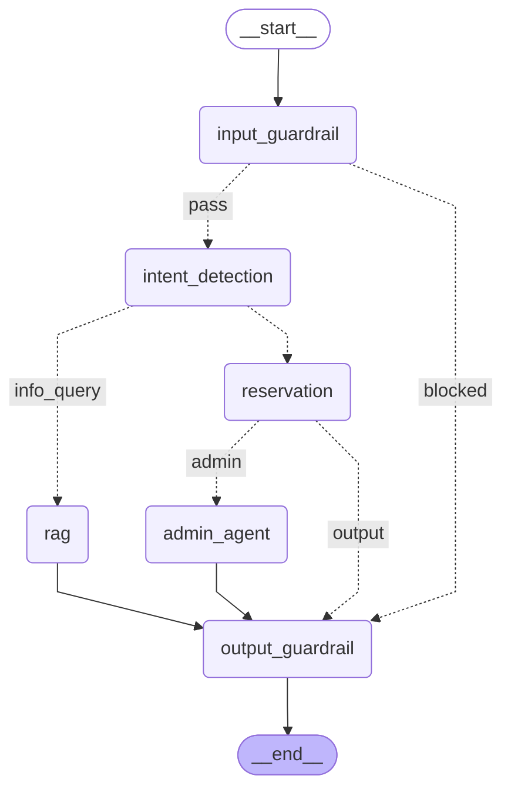

# CityPark Agent — LangGraph Architecture

The diagram below is auto-generated from the live graph definition.

## Node descriptions

| Node | Role |
|------|------|
| `input_guardrail` | Presidio PII/injection filter — blocks harmful input before it reaches the LLM |
| `intent_detection` | GPT-4o classifies message as `info_query`, `reservation`, or `unknown` |
| `rag` | ChromaDB retrieval + live DB context → GPT-4o generates parking info answer |
| `reservation` | Stateful 7-step data collection (name → confirm) using LangGraph checkpointing |
| `admin_agent` | ReAct agent saves to SQLite, emails admin, then `interrupt()` suspends graph |
| `output_guardrail` | Presidio anonymiser scrubs PII from the final response |
